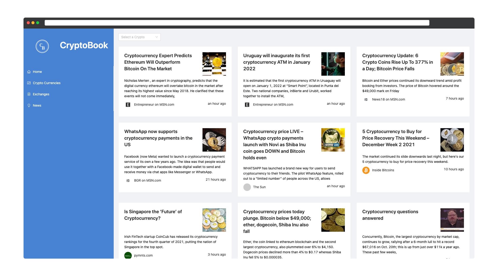
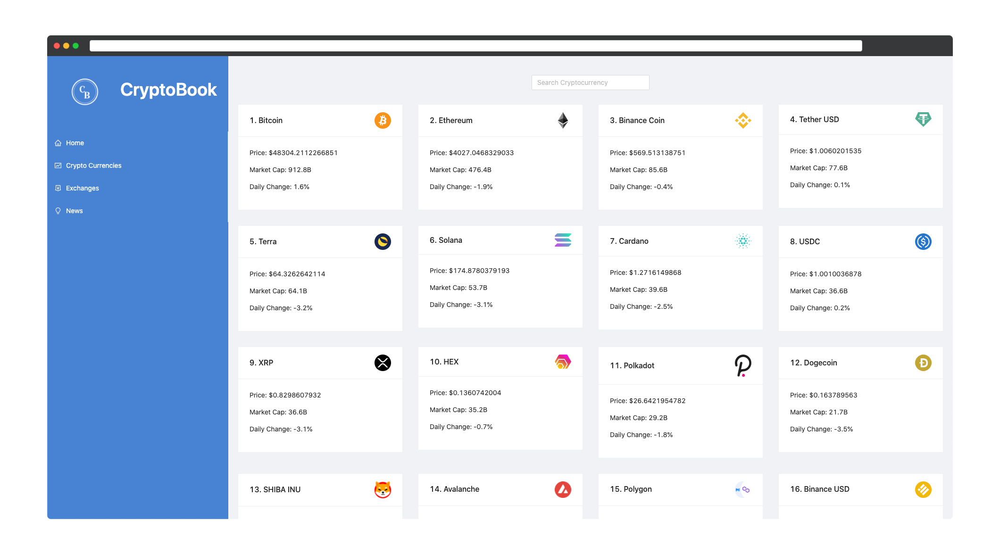

# CryptoBook
A React project that utilizes RapidAPIs to report the latest news and price of the top 100 traded cryptocurrencies 

# Technologies Used
- React
  - [React ChartJS2](https://www.npmjs.com/package/react-chartjs-2)
  - [Millify](https://www.npmjs.com/package/millify)
- RapidAPI
  - [CoinRanking API](https://rapidapi.com/Coinranking/api/coinranking1)
  - [News Bing Search API](https://rapidapi.com/microsoft-azure-org-microsoft-cognitive-services/api/bing-news-search1/) 

# Screenshots
**Home Page**
  

**News Page**
  

**Currencies Page**
  
  
**Exchanges Page**
  
